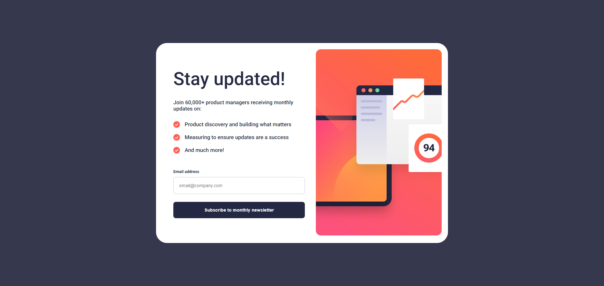

# pablodev - Newsletter sign-up form with success message solution

### Note of coder in PT-BR

**É galera, mais uma solução com 40% das minhas mãos, devo dizer que essa linguaguem foi a mais dificil para aprender até agora, mas é um desafio a ser completo em breve, não pretendo parar, sei que aos poucos minhas linhas melhoram e se tornam mais fluidas, há meses atrás eu nem sabia o que era CSS e HTML, vamos pra cima!**

This is a solution to the [Newsletter sign-up form with success message challenge on Frontend Mentor](https://www.frontendmentor.io/challenges/newsletter-signup-form-with-success-message-3FC1AZbNrv). Frontend Mentor challenges help you improve your coding skills by building realistic projects. 

## Overview

### Screenshot

### Links

- Solution URL: [Add solution URL here](https://your-solution-url.com)
- Live Site URL: [Add live site URL here](https://your-live-site-url.com)

## My process

### Built with

- Semantic HTML5 markup
- CSS custom properties
- Flexbox

### What I learned

Little by little as you get more superficial with JavaScript, I believe that perhaps I should change the methodology and test myself more by leaving myself alone with the language, in any case, I feel an improvement

## Author

- Website - [pablodev portfolio](https://www.pabloteixeira.site)
- Frontend Mentor - [@pabloodev](https://www.frontendmentor.io/profile/pabloodev)
